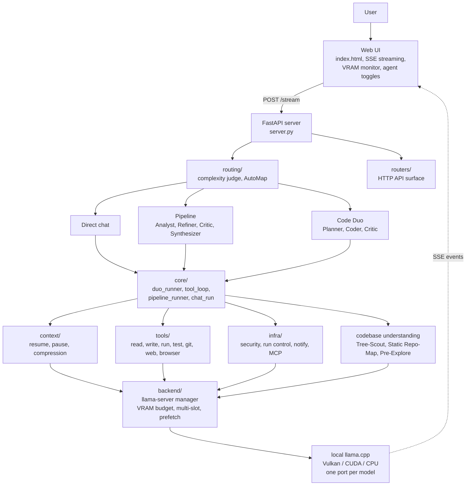
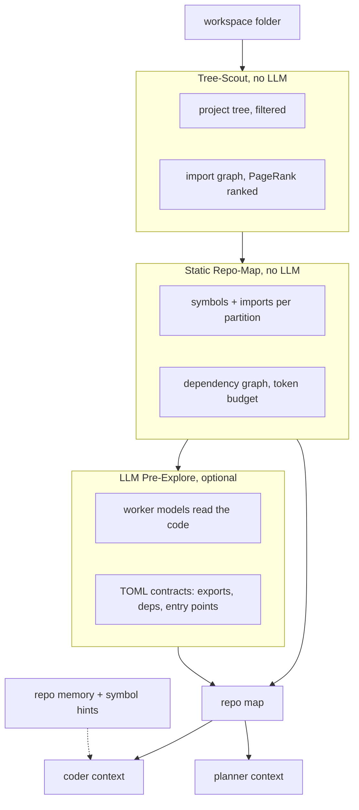

# HiveMind Architecture

How the main pieces of HiveMind fit together, and how context is built, pinned,
guarded and compressed during a `code_duo` agentic run. Part 1 is the map, the
rest is the reference. For usage and settings see the [README](../README.md).

## 1. System Overview

HiveMind is a FastAPI server (`server.py`) that routes each request into one of
several run pipelines and down to locally loaded llama.cpp models. Everything
runs on your own machine.



The `routers/` package exposes the HTTP API; orchestration (planning, tool
loops, critic reviews, chunking) lives in `core/`. `backend/` manages the
llama-server worker processes within a VRAM budget and streams results back
to the UI.

## 2. Codebase Understanding

Before a coding task runs, HiveMind builds a picture of the workspace in three
layers. The first two are deterministic code analysis with no LLM involved, the
third is optional. The resulting map is injected into Planner and Coder
context.



Tree-Scout and the static map are on by default (`duo_tree_scout_enabled`,
`duo_static_map_chars=0` for the auto budget), pre-explore is off
(`duo_pre_explore=false`) and worth enabling when the static map alone is not
enough. Whether the coder context contains a symbol index or real file
contents matters a lot downstream; that distinction is covered in section 6.

---

# Part 2: Context Flow and Compression

How context behaves across an agentic coder run: where it lives, what survives
compression, what breaks the prompt cache, and which guards keep the loop
honest. Verified against the code; a few numbers are measured from live runs
and marked as such.

## 3. The run at a glance

```
Repo map build    (deterministic: paths + symbols, no file contents)
      |
      v
Planner phase     (system + repo map + user goal -> task list)
      |
      v
Coder tool loop   (read / write / edit / run_tests / browser)
      |            compression fires when context nears the budget
      v
Verify            (browser text snapshot + console, or vision model)
```

Two models are typically involved: the Planner (often the same loaded model
instance as the Coder, reused only when the slot ctx is large enough, see
section 12) and the Coder running the tool loop.

## 4. Message tiers

The context splits into four tiers. Only the first is truly immutable; the
rest get less stable toward the tail.

| Tier | Contents | Survives compression |
|---|---|---|
| Pinned / stable | System message, tool definitions, pinned repo map | Yes, byte-identical |
| Structured state | Plan, decisions, error-rollup summaries | Partially, re-injected after compression (`[COMPRESS-PLAN-PIN]`) |
| Hot raw tail | Recent turns, current tool calls and results | No, this is what compression rewrites |
| Run-state (Python side) | Error counters, read-tracking sets, no-op counters | Yes, lives outside the LLM history entirely |

The last row is the rule that shapes most of this design: anything that must
survive compression is Python run-state, never something inferred from message
history.

## 5. Repo map pinning

`core/repomap_pin.py` extracts the `## Static Repo-Map` block (paths and
symbols, no file contents) from the first user message and moves it into the
system message under a `[REPO-MAP — pinned, byte-stable]` marker
(`_PIN_MARKER`). It runs once per built message list, before the first
request, gated by `duo_pin_static_map` (default on). Re-pinning an
already-pinned system is a no-op.

The map is frozen for the life of a run. There is no delta generator, so files
created or deleted mid-run do not appear in the pinned map until the next run.
That is a known, deliberate gap (there is a TODO in `core/repomap_pin.py`).

The point of the pinning is cache stability: the stable prefix grows from
system + tool definitions (~7.1k tokens) to system + tools + map (~8k+),
measured live. After a compression the `[MSGSIG-CHANGE]` diagnostic
(duo_runner.py) may only ever flag `user[1]`, never `system[0]`; a historical
incident where compression wrote into the system message is preserved as a
proof comment in `core/duo_runner.py`.

The `## Codebase Architecture Map` block (partitions and contracts) is
deliberately not pinned. It stays in the compressible tier and is protected
instead by the compression validator's anchor check (section 7).

## 6. The context-truth flag

`has_explore_ctx` must reflect whether real file contents are in context. A
static symbol map is not file content, and confusing the two was once the root
cause of blind full-file overwrites: the model was told twice (template plus
rule text) that it did not need to read, when only a symbol index was present.

The flag's source of truth is Python state, not message sniffing:
`_explore_has_contents = bool(state.get("_pre_explore_msgs")) or
bool(state.get("_contracts_raw"))` in `core/duo_runner.py`.

- Map only: the coder gets the `DUO_CODER_UNEXPLORED` template
  (`hive_functions/prompts.py`) plus the rule text `STATIC SYMBOL INDEX ONLY`,
  which orders `read_file` before changing any existing file and reserves
  `write_file` with full content for new files.
- Real pre-explore content in context: the `DUO_CODER_EXPLORED` template, whose
  "no read_file needed" shortcut is valid there because the content genuinely
  is present.

The write-guard in `tools/runner.py` (section 9) backstops the same rule
deterministically.

## 7. Compression

### Trigger

`[CTX-FULL]` fires when the estimated token count leaves too little headroom
for a safe tool round. The threshold comes from `resolve_compress_threshold`
(`context/ctx_guard.py`): the smaller of `floor * ctx` and
`ctx - overflow_reserve`, with the reserve defaulting to 1024. It sizes the
threshold only; `max_tokens` is handled separately.

The threshold sits on a dynamic output reserve: compression normally kicks in
at about 70 percent of ctx (`duo_compress_auto_floor`), and as the context
approaches it, the per-round output budget is shrunk to the remaining free
space instead of letting the request overflow. A budget under 1024 then takes
the `[CTX-FULL]` path.

A forced compression (`trigger=force`) has three causes:

1. The model warned about sliding-window reprefill (once per run).
2. The tool POST was rejected with an HTTP 400 context overflow, which sets
   `force_compress` in the tool loop result.
3. The min-viable guard: after `clamp_request_max_tokens` and the raw ctx cap,
   a `max_tokens` budget under 1024 for four consecutive rounds.

`max_tokens` itself is only ever clamped, never compressed away.

### Model selection

First choice is the configured light model (`duo_compress_model`, default
`lfm2.5:2.6b`). If it does not fit into free VRAM, the coder model runs the
compression instead. That fallback is the common case on tight VRAM and costs
about 100 to 140 seconds per compression, measured. The trade-off to know
about: loading the light model can evict the coder (Vulkan serialization) and
throw away the whole KV cache. Candidate mitigations are partial compression
(the default first resort, below) and pinning the coder during a run; there is
a TODO block for it in `core/duo_runner.py`.

### Summary generation

`_compress_tool_context()` (`context/compression.py`) asks the model for a
compact summary, max 400 words for the tool-context compressor (the separate
chat-session compressor uses 300). Partition labels and plan-anchor words are
injected into the prompt as required-verbatim anchors, which is exactly what
`_validate_compression_summary()` checks afterwards: labels present, anchors
present, no hallucination phrases, minimum length. If validation fails, a
rule-based fallback compressor runs instead of trusting a bad summary.

### Mini-shrink retry

If a completed full compression shrank the context by less than 15 percent,
with the pre-compression estimate above 2048 tokens, one escalated retry runs
automatically. It calls the same compressor with an added prompt nudge to cut
more aggressively, on the pre-compression messages. There is never a hard
token quota; cutting stays relevance-driven so the retry cannot become its own
source of information loss. The retry runs before the validator, so its output
is checked like any other, and its result replaces attempt one unconditionally
(last attempt wins). Logged as `[CTX-COMPRESS-RETRY]` with a `retry_helped`
field. This applies to full mode only; partial compression escalates by a
different route.

### Post-compression cleanup

- `[READ-GUARD]` trims the short-term "recently read, don't re-inject" hint
  list. The compression-resilient `_any_read_set` the write-guard depends on
  is never touched.
- `[COMPRESS-CLEANUP]` clears stale call signatures and CTX notices.
- `[COMPRESS-PLAN-PIN]` re-injects the current plan so it survives the
  rewritten tail.
- The rebuild keeps the live system message (with the pinned map) instead of
  re-deriving it from a template. That is what keeps `system[0]` byte-stable.

### Partial compression (default first resort)

`duo_partial_compression` (default on) adds a cache-friendly pass before any
full rewrite. A cut index splits the raw tail: everything before the cut is
replaced by the summary, while the most recent messages (at least eight) stay
byte-identical, targeting 60 percent or less of the pre-compression context.
Because the tail after the summary is unchanged, llama.cpp's suffix shift
(`--cache-reuse`) can re-apply and the prompt cache survives far better than
after a full compression. If the partial pass shrank nothing meaningful, it
escalates to a full compression.

Full compression remains the fallback and has two structural costs, both
measured: the suffix shift is anchored at the point of divergence, and models
with hybrid attention (Ling's KDA linear-attention layers, for example) have no
KV matrix to shift at all, so their state is recomputed. After every full
compression, cache reuse drops to roughly 30 to 50 percent and climbs back to
90 to 100 percent over the next rounds. That is expected, not a bug, and it is
the main reason partial compression runs first.

### Emergency eviction

In-place history eviction is no longer a normal-path mechanism.
`[CTX-EVICT-EMERGENCY]` fires only when the compression cap
(`duo_max_compressions`, default 40) is exhausted and the ctx guard reports
over 90 percent. It goes through `evict_stale_tool_outputs` /
`evict_stale_reads_for_path`, which respect `cache_horizon`: messages already
sent to llama.cpp are never mutated in place, only the tail is rewritten. The
old `duo_cache_friendly_ctx` path was removed entirely; compression-first is
unconditional now.

Slot eviction (LRU, pre-flight, idle, in `backend/manager_evict.py`) is VRAM
management, not context management. A VRAM-driven slot kill does wipe the
coder's KV cache; that residual risk is the accepted trade-off noted under
model selection.

### Stability mechanisms for smaller models

- No-think retries: tool-call JSON parse failures get an automatic retry with
  `enable_thinking: false` for that round. Small models that burn their budget
  on a thinking block get a clean second attempt.
- Stub-echo guard: `[STUB-ECHO]` detects a model echoing placeholder text back
  as a tool result and replaces it with an error notice.
- Smoke-test nudge: if the coder finishes a fix loop without ever running the
  test suite, a nudge pushes one `run_tests` round.

## 8. Error rollup

`core/error_rollup.py` is pure parse and diff logic, no LLM involved.

Parsing is per formatter: pytest bottom-up, tsc and eslint top-down, generic
`file:line:col:message`. Identity is the exact `(error_type, message_body)`
pair, never fuzzy matched. File and line are metadata only, so an error that
moves from line 42 to 43 is still the same error and shows as `PERSISTS`;
any change to the message body counts as `NEW`. The rule the codebase follows:
never guess that two different messages are the same error. Better to
under-deduplicate than to hide a real new error from the model.

Rendered states: `NEW` in full detail, `PERSISTS` as one line with first-seen
and fix-attempt counters, `FIXED` as one line, and `REOPENED` when a `FIXED`
signature reappears later, resetting the counter and pointing at the round
where it was previously fixed, so the model sees an honest regression marker
rather than a misleadingly continuous one. `RollupState` is Python run-state
and survives compression by design; `on_message_history_compressed()` is a
no-op marker documenting that non-coupling.

The integration point is the run_tests result path only, gated by
`duo_error_rollup`. It is independent of the generic 8000-character tail-cut
applied to any oversized tool output.

## 9. Write-guard

Two deterministic guards live in `tools/runner.py`.

The narrow `duo_full` guard (gate `duo_write_guard_enabled`, default on)
blocks `write_file`, and only `write_file`, when it targets an existing file
that has not, in this run, been read (via `_read_set` or the
compression-resilient `_any_read_set`), written by the agent itself, genuinely
present in context from real pre-explore content, or explicitly allowed via
`allow_overwrite`.

Outside `duo_full`, the relaxed guard (gate `read_guard_enabled`) blocks the
whole write and edit family (`edit_file`, `patch_file`, `write_file`,
`write_file_append`, `replace_lines`) on existing, never-seen files with the
same `READ_REQUIRED` mechanics.

A note on `patch_file`: it stays registered so old persisted sessions keep
working, but it is no longer advertised to models. The model-facing toolset is
`edit_file` (search/replace) plus `write_file`. An earlier, broader version of
the guard also blocked `edit_file`, which produced unusable empty-diff errors
on legitimate full-file rewrites; the current narrow scope does not reproduce
that failure mode.

## 10. No-op edit detection

Separate from the write-guard, the system tracks consecutive zero-effect
`edit_file` / `patch_file` / `write_file` calls per path (markers like
`EDIT_FILE_NOOP` or `PATCH_FILE_OLD_STR_NOT_FOUND`, often a stale search block
pointing at pre-compression content). The streak lives in
`DuoRoundState.edit_noop_streak`, Python run-state, so it is compression-proof.
After two consecutive no-ops on one path, a `[NO-OP]` hint suggests a fresh
`read_file`; a successful edit resets the streak. Gated by
`duo_noop_hint_enabled` (default on). Related: `edit_file` results report
`+0 lines, +N chars` when a same-line-count change actually happened.

Known follow-up (TODO in `core/tool_executor.py`): arg-compact strips written
content from history, which can push later rounds into full-file rewrite churn
on files whose content is no longer visible. Size thresholds or a read-first
nudge are planned.

## 11. Read ladder

`core/tool_executor.py` tracks consecutive reads per path. Only repeated reads
of the same path escalate the counter; reading a different path resets it, and
any write, edit or run call resets it to zero and clears the fired flag.
Re-exploring many different files therefore never fires the ladder. Only
re-reading the same file without acting does, once the streak reaches three,
no ladder hint is active, and at least one write/edit/run result is already in
the round messages. That last condition keeps the ladder quiet during a
model's first legitimate exploration wave.

The ladder state persists on `ToolRoundState` and is Python run-state.
Related loop mechanics: when the round budget expires mid-work, one grace
round is granted, and a successful write extends the run deadline by 300
seconds.

## 12. Ctx sizing and VRAM fallbacks

### Pre-flight margin chain (`resolve_ctx_fit`, `backend/llama_manager_utils.py`)

1. Try the requested ctx at full margin (768 MiB headroom beyond model size).
2. If blocked, retry the same ctx at a reduced margin (256 MiB), logged as
   `[PRE-FLIGHT-REDUCED-MARGIN]`.
3. Still blocked and the caller is graceful (the default for non-coder
   callers): step down the context ladder 16384, 12288, 8192, each rung at
   full then reduced margin. A 4096 fallback is allowed only when the request
   itself was small (at or under `CTX_DOWN_MIN` = 8192).
4. If nothing fits, or the caller is strict: an explicit `VRAMPreFlightError`
   with model-swap suggestions. Coder loads are strict. There is no silent
   degradation for them: the requested ctx either fits at full or reduced
   margin, or the load fails loudly. This replaced an earlier bug where the
   system silently loaded at ctx=4096, too small for a typical coder system
   prompt, and produced an immediate confusing loop-detect stop.

Guard C (`[CTX-FLOOR-STOP]`) closes the remaining gap: if a slot still came up
degraded and the round-1 baseline (pinned system, map, plan, goal) already
exhausts the usable floor, the run aborts before the first tool round instead
of churning through compression paths.

### Planner to coder slot reuse

The Planner loads gracefully, a degraded planner slot is acceptable. A warm
planner slot is inherited by the Coder only when its actual loaded ctx is at
least the Coder's requirement. On mismatch (`[PLANNER=CODER-CTX-MISMATCH]`)
the Coder loads fresh at full ctx, strictly. If the slot's real ctx cannot be
queried, reuse is skipped conservatively.

### Model-level VRAM fallback

If the primary coder model cannot be loaded at all, even at the ctx floor, the
system falls back to a smaller model (`_resolve_fallback_model`: preferred
candidate, then a deterministic preference list, then the smallest fitting
installed model). The actually-loaded fallback ctx is captured as an override
(`[CODER-FALLBACK-CTX]`) and clamped into every downstream ctx decision for
the rest of the run, so the smaller slot is never compared against the
original larger target, which previously caused a spurious ctx-mismatch stop.
The override does not persist across runs; a fresh run always retries the full
target ctx first.

### Reclaim wait

VRAM reclaim after an eviction targets the achievable reduced-margin threshold
rather than the original full-margin target, and aborts early when no
measurable progress (under 64 MiB) is being made. This replaced a prior bug
where the system waited a futile 45 to 90 seconds for a VRAM target that was
mathematically unreachable given the GPU load at the time.

## 13. Log marker reference

| Marker | Meaning |
|---|---|
| `[STATIC-REPO-MAP-ONLY]` | Symbol-only map built, no LLM pre-explore this session |
| `[REPO-MAP-PIN]` | Repo map moved into the pinned system message |
| `[CTX-EFFECTIVE]` / `[CTX-ACTUAL]` | Configured vs actually loaded slot ctx |
| `[PLANNER=CODER-CTX-MISMATCH]` | Warm slot too small for the coder, fresh load forced |
| `[PRE-FLIGHT]` | VRAM pre-flight result before a model load (OK or BLOCK) |
| `[PRE-FLIGHT-REDUCED-MARGIN]` | Loading with 256 MiB margin instead of 768 |
| `[PRE-FLIGHT-CTX-DOWN]` | Stepping down the ctx ladder (graceful callers only) |
| `[PRE-FLIGHT-EVICT]` | Pre-flight evicted a slot to make room |
| `[PRE-FLIGHT-GRACE]` | Post-eviction recheck, stall-abort capable |
| `[VRAM-RECLAIM]` | Reclaim wait result, reached or stall-aborted |
| `[CODER-VRAM-FALLBACK]` | Primary coder model did not fit, smaller fallback loaded |
| `[CODER-FALLBACK-CTX]` | Fallback ctx override applied to downstream guards |
| `[CTX-FLOOR-STOP]` | Degraded slot below floor plus baseline does not fit, abort |
| `[CTX-FULL] skip=N/4` | Not enough headroom for a safe round, compressing first |
| `[CTX-COMPRESS] trigger=...` | Compression start (force, 90pct or threshold) |
| `[CTX-COMPRESS] done ...` | Compression done, mode partial or full, before and after sizes |
| `[COMPRESS-MODEL]` | Which model ran the compression |
| `[CTX-COMPRESS-RETRY]` | Mini-shrink retry result incl. retry_helped |
| `[CTX-COMPRESS-RULE]` | Rule-based fallback applied after the LLM summary failed validation |
| `[COMPRESS-PLAN-PIN]` | Plan re-injected after compression |
| `[MSGSIG-CHANGE]` | Early-prefix signature change, must never implicate system[0] |
| `[CTX-EVICT-EMERGENCY]` | Last-resort eviction, compression cap exhausted and ctx over 90% |
| `[GRACE ROUND EXPIRED]` | Grace round used up after budget exhaustion |
| `[DEADLINE-GRACE]` | Run deadline extended after a successful write |
| `[STUB-ECHO]` | Model echoed stub text as tool output, replaced with an error |
| `[READ-GUARD]` | Short-term read-hint cleanup after compression |
| `[TOOL_ERROR: READ_REQUIRED]` | Write blocked on an unread existing file |
| `[NO-OP]` | No-op hint after two consecutive zero-effect edits on one path |
| `[READ LADDER]` | Read-ladder state transition |
| `[LOOP-DETECT-STOP]` | Terminal guard, check the diagnostic fields on the line |
| `[TOOLCALL-REPAIR]` | Truncated or invalid tool call sanitized out of history |

## 14. Design principles

1. Deterministic over LLM-dependent, wherever structure is known: errors,
   paths, read tracking. LLM judgment is reserved for genuinely unstructured
   content.
2. Run-state is not message history. Anything that must survive compression
   lives on the Python side.
3. Fail explicitly, never degrade silently. A model that cannot load at a
   usable ctx errors out clearly instead of limping along at ctx=4096.
   Graceful callers with small requests are the one sanctioned exception.
4. Every new guard ships with a settings flag to turn it off, defaulting to
   the safer behavior.
5. Compression optimizes for relevance, not a token quota. Even the escalated
   retry only asks for more aggressive cutting, never a fixed percentage.

Some numbers in this document (prefix sizes, compression duration, cache reuse
ranges, reclaim wait times) are measured from live runs and consistent with,
but not derivable from, the code. Everything else matches the code; since
HiveMind moves fast, prefer function names over remembered line numbers when
you go looking.
