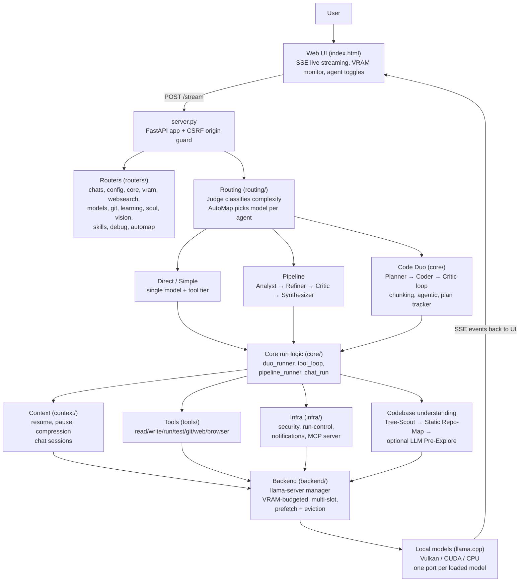
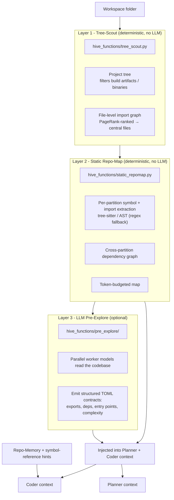

# HiveMind Architecture

This document describes how the main components of HiveMind fit together.
**Part I** gives a high-level visual overview of the components (the matching
sections of the [README](../README.md) contain the detailed text). **Part II**
is the technical reference for how context is built, pinned, guarded, and
compressed across a `code_duo` agentic run — the mechanics an incoming
engineer needs, verified against the code as of 2026-09-10 (regression suite
`python tests/run_regressions.py`: 47/47 suites pass).

## 1. System Overview

HiveMind is a FastAPI server (`server.py`) that streams requests through a
routing layer and one of several run pipelines, down to locally loaded
llama.cpp models. Everything runs on your own machine.



The `routers/` layer exposes the HTTP API, while the actual run orchestration
(planning, tool loops, critic reviews, chunking) lives in `core/`. The
`backend/` package manages llama-server worker processes within a VRAM budget
and streams results back to the UI.

## 2. Codebase Understanding Layers

When HiveMind analyzes a workspace for a coding task, it does so in three
layers. Two of them are pure, deterministic code analysis with no LLM involved;
the third is optional and uses worker models. The resulting map is injected into
the Planner and Coder context.



Layer 1 is on by default (`duo_tree_scout_enabled=true`). Layer 2 is also on by
default, with an auto-budgeted map (`duo_static_map_chars=0`). Layer 3 is off by
default (`duo_pre_explore=false`) — enable it in `settings.json` when the static
map alone is not enough.

The distinction between "static map only" and "real pre-explore ran" is the
context-truth flag described in §6; how the resulting context is pinned,
guarded, and compressed is Part II of this document.

---

# Part II — Context Flow & Compression (agentic coder run)

## 3. Pipeline overview — where context lives at each stage

```
RepoMap Build (deterministic, paths+symbols only, no file contents)
        │
        ▼
Planner phase  (system + RepoMap + user goal → task list)
        │
        ▼
Coder tool-loop (read_file / write_file / edit_file / run_tests / browser)
        │   ↕ compression fires when context nears budget
        ▼
Verify (browser text-snapshot + console, or vision model if screenshots needed)
```

Two models are typically involved: a Planner (often the same model instance as
the Coder, reused only when the loaded slot ctx is large enough, see §12) and
the Coder, which runs the actual tool loop.

## 4. Message tiers

The context is conceptually split into four tiers. Only the first is truly
immutable; the rest degrade in stability toward the tail.

| Tier | Contents | Survives compression? |
|---|---|---|
| **Pinned / stable** | System message, tool definitions, pinned RepoMap | Yes — byte-identical, never rewritten |
| **Structured state** | Plan, decisions, error-rollup summaries | Partially — re-injected after compression (`[COMPRESS-PLAN-PIN]`) |
| **Hot raw tail** | Recent turns, current tool calls/results | No — this is exactly what compression rewrites |
| **Run-state (Python-side, not a message tier)** | Error counters, read-tracking sets, no-op counters | Yes — lives outside the LLM message history entirely |

The last row is the most important architectural principle in this codebase:
**anything that must survive compression is Python run-state, never something
inferred from message history.**

## 5. RepoMap pinning

- `core/repomap_pin.py` extracts the `## Static Repo-Map` block (paths +
  symbols, deterministically built, no file contents) out of the first user
  message and moves it into the system message under a
  `[REPO-MAP — pinned, byte-stable]` marker (em-dash — `_PIN_MARKER`,
  repomap_pin.py:21).
- Runs once per built message list, before the first request (gate:
  `duo_pin_static_map`, default on). Idempotent via a marker guard
  (`_already_pinned()`) — re-pinning an already-pinned system is a no-op.
- The map is frozen for the life of a run. There is currently **no delta
  generator** — new/deleted files created during the run are not reflected in
  the pinned map until the next run. This is a deliberate, documented gap (TODO
  in `core/repomap_pin.py`), not an oversight.
- Effect: extends the stable cache prefix from ~7.1k tokens (system + tool defs
  only) to ~8k+ tokens (system + tool defs + map). *(Measured from live logs,
  not code-derivable.)* Confirmed live: `[MSGSIG-CHANGE]` after compression
  only ever touches `user[1]`, never `system[0]`. The live `[MSGSIG-CHANGE]`
  warning (core/duo_runner.py:4153) flags any signature change below the ~10k-token
  prefix horizon; a historical incident where compression wrote to `system[0]`
  is preserved as a proof comment at core/duo_runner.py:3534–3536.
- `## Codebase Architecture Map` (partitions/contracts) is deliberately **not**
  pinned — it stays in the compressible tier, protected instead by the
  compression validator's anchor check (see §7).

## 6. Context-truth flag (why the write-guard needed a fix)

`has_explore_ctx` must reflect whether **real file contents** are in context,
not just whether *any* pre-explore artifact exists. A static symbol-only map is
not file content.

- Correct source: `_explore_has_contents = bool(state.get("_pre_explore_msgs"))
  or bool(state.get("_contracts_raw"))` (core/duo_runner.py:1582).
- Map-only → `DUO_CODER_UNEXPLORED` system template (hive_functions/prompts.py:289,
  starting `CODEBASE — UNEXPLORED:` … `Read exactly ONE file, then edit/write
  it before reading the next.`) plus the `[Codebase analysis]` rule text
  `STATIC SYMBOL INDEX ONLY — the list below contains file paths, symbols, and
  imports, NOT the files' contents` (core/duo_runner.py:2365), which orders
  `read_file` before changing any existing file and reserves `write_file` with
  full content for NEW files.
- Real LLM pre-explore results → `DUO_CODER_EXPLORED` template
  (hive_functions/prompts.py:268, `CODEBASE — EXPLORED:`), whose
  "no read_file needed" shortcut (@279) is valid there, because content
  genuinely is in context.

Getting this flag wrong was the root cause of blind full-file overwrites on
existing files — the model was told twice (template + rule text) that it didn't
need to read, when only a symbol index was present. The `tools/runner.py`
write-guard (§9) backstops the same rule deterministically.

## 7. Compression

### Trigger
`[CTX-FULL]` fires when the estimated token count leaves insufficient headroom
for a safe tool round relative to the resolved threshold
(`resolve_compress_threshold` in `context/ctx_guard.py:55`: the smaller of
`floor·ctx` and `ctx − overflow_reserve`, where `overflow_reserve` defaults to
1024 — note it only sizes this threshold; it does **not** clamp `max_tokens`).

The threshold itself sits on a **dynamic output reserve** (duo_runner.py:3166–3190):
compression normally kicks in at ~70% of ctx (`duo_compress_auto_floor`, default
0.70), and as the context approaches the threshold the per-round output budget
(`max_tokens`) is shrunk to the remaining free space instead of letting the
request overflow — a sub-1024 budget then triggers the `[CTX-FULL]` path.

A forced compression (`trigger=force`) has **three** distinct causes:

1. **SWA reprefill zone** — the model warned about sliding-window reprefill
   (core/duo_runner.py:3532, once per run via `_swa_triggered_compress`).
2. **Mid-round HTTP 400 context overflow** — the tool POST was rejected by the
   server with a prompt/context/token overflow (`core/agentic_tool_loop.py:233–239`
   → sets `result["force_compress"]` → core/duo_runner.py:4303–4306).
3. **`[CTX-FULL]` min-viable guard** — after `clamp_request_max_tokens`
   (factor 1.35, reserve 768, min output 256; ctx_guard.py:170–200) and the
   hard `> ctx` cap, a max_tokens budget under 1024 for 4 consecutive rounds
   forces compression (core/duo_runner.py:4167–4205).

`max_tokens` itself is only ever clamped, never compressed away: the clamps
above plus the raw ctx cap at core/duo_runner.py:4158–4180.

### Model selection
1. Try the configured light model (`duo_compress_model`, default `lfm2.5:2.6b`)
   — logged `[COMPRESS-MODEL] compression via <model>`.
2. If it doesn't fit in free VRAM, fall back to the Coder model itself — logged
   `[COMPRESS-MODEL] light model ... does not fit ... using coder model for
   compression`. This is the common case on tight VRAM and costs ~100–140 s per
   compression instead of a lighter/faster pass. *(Measured from live logs.)*
   Trade-off: `ensure_loaded` for the light model can evict the coder (Vulkan
   serialization) and lose the whole KV cache; candidates to fix this are
   `duo_partial_compression` (now the default first resort, see below) and/or
   pinning the coder during a run — see the TODO block at
   core/duo_runner.py:3731.

### Summary generation
`_compress_tool_context()` (`context/compression.py`) asks the model for a
compact summary (**max 400 words** for the tool-context compressor,
compression.py:355; the separate chat-session compressor uses 300,
compression.py:554), with **partition labels and plan-anchor words injected as
required-verbatim anchors** in the prompt — this is what
`_validate_compression_summary()` checks afterward (labels present, plan anchor
words present, no hallucination phrases, minimum length). If validation fails,
a rule-based fallback compressor (`_compress_rule_based`, compression.py:167)
runs instead of trusting a bad LLM summary.

### Mini-shrink retry (escalation, not a hard target)
If a completed **full** compression shrinks the context by **<15%** (and the
pre-compression estimate was above 2048 tokens), one additional escalated retry
runs automatically (core/duo_runner.py:3795–3830; the retry only applies when
the compression ran in `full` mode — partial compression escalates differently,
see below):

- Same `_compress_tool_context()` call on the pre-compression messages, with
  `aggressive_retry=True` appending a soft escalation to the prompt: cut
  aggressively this time, "relevance before quota, but do not shy away from a
  large reduction" (compression.py:370–379).
- No hard token-count target is ever enforced — cutting is always
  relevance-driven, never quota-driven, to avoid the retry itself becoming a
  source of information loss.
- The retry runs **before** the existing validator, so the validator
  automatically checks the retry's output too (no second validator needed).
- The retry's result replaces attempt 1 unconditionally (last attempt wins);
  quality is then gated by the same validator + rule-based fallback path.
- Logged as `[CTX-COMPRESS-RETRY] before=… after1=… after2=… retry_helped=<bool>`
  — `retry_helped` is true if attempt 2 shrank meaningfully further (≥15% below
  attempt 1) or the total shrink vs. `before` cleared the 15% bar.

### Post-compression cleanup
- `[READ-GUARD] Compression: removed N compacted read_file paths from the read
  guard` — this trims the *short-term* "recently read, don't re-inject" hint
  list (`_read_set`), **never** the compression-resilient `_any_read_set` that
  the write-guard depends on (§9).
- `[COMPRESS-CLEANUP]` clears stale call signatures and CTX notices.
- `[COMPRESS-PLAN-PIN]` re-injects the current plan/subtask list so it isn't
  lost inside the rewritten tail (core/duo_runner.py:3923, and :4084 on the
  rule-fallback path).
- Pin-preserving rebuild: the compression rebuild keeps the **live** system
  message (with the pinned map) instead of re-deriving it from a template —
  this is what keeps `system[0]` byte-stable.

### Partial compression (prefix-cache-preserving, default)
`duo_partial_compression` (default **on**, settings.py:136) adds a
cache-friendly first resort before a full rewrite:

- `should_use_partial` / `plan_partial_cut_index` (`context/ctx_guard.py:150`
  and :213) decide whether the overflow can be relieved by cutting only the
  older part of the raw tail: everything up to the cut index is replaced by the
  summary, while the **most recent messages (min 8) stay byte-identical** —
  target ≤60% post-compression context.
- Execution lives in `context/compression.py:329` (summary covers only the
  messages before the cut; the tail is reattached untouched). Because the tail
  after the rewritten summary is byte-stable, llama.cpp's suffix shift
  (`--cache-reuse`) can re-apply — the prefix cache survives far better than
  after a full compression.
- If a partial pass shrank nothing meaningful, it escalates to a **full**
  compression (`PARTIAL-ESCALATE`, core/duo_runner.py:3968–3980).

Full compressions remain the fallback when partial is insufficient or disabled.
Two structural limits keep full compression expensive (measured from live
logs): llama.cpp's suffix-shift is anchored at the point of divergence, and
models with hybrid/recurrent attention (e.g. Ling's KDA linear-attention
layers) have no KV matrix to shift at all — their state must be recomputed.
Consequence after every **full** compression: cache reuse drops to roughly
30–50% and climbs back to 90–100% over the next rounds. This is expected,
not a bug — and the main reason partial compression is tried first.

### Emergency valves (evict, demoted)
In-place history eviction is no longer a normal-path mechanism:

- `[CTX-EVICT-EMERGENCY]` fires only when the compression cap is exhausted
  (`duo_max_compressions`, default 40) **and** the ctx guard reports >90% —
  the last resort before a stop (core/duo_runner.py:3599, :3641).
- It goes through `evict_stale_tool_outputs` /
  `evict_stale_reads_for_path` (`context/compression.py`), which respect
  `cache_horizon`: messages already sent to llama.cpp are never mutated
  in-place — the prompt prefix cache stays valid; only the tail is rewritten.
- The old `duo_cache_friendly_ctx` A/B path (and its `[CTX-EVICT-LEGACY]`
  marker) was removed entirely on 2026-09-09 — compression-first is now
  unconditional.

Slot-level eviction (LRU / pre-flight / idle, `backend/manager_evict.py`) is
VRAM management, not context management — but a VRAM-driven slot kill does wipe
the coder's KV cache; that residual risk is the accepted trade-off documented
above (compression model selection).

### Stability mechanisms for smaller models (added 2026-09-10)
- **No-Think retries:** tool-call JSON parse failures trigger an automatic
  retry with `enable_thinking: False` for that round (core/duo_runner.py:
  3217–3222, 4246–4249) — small models that burn their budget on a thinking
  block get a clean second attempt.
- **Stub-echo guard:** `[STUB-ECHO]` (core/tool_executor.py:162–167, :329)
  detects a model echoing the placeholder/stub text back as a tool result and
  replaces it with an error notice instead of letting the loop continue on
  garbage.
- **Smoke-test nudge:** if the coder finishes a fix-loop without ever running
  the test suite, a nudge pushes one `run_tests` round (state flag
  `at_nosuite_nudged`, core/tool_exec_helpers.py:990; core/tool_executor.py
  :442, :485).

## 8. Deterministic error rollup (test/lint fix-loop)

`core/error_rollup.py` — pure parse/diff logic, no LLM involved.

- Per-formatter parsing: pytest (bottom-up), tsc/eslint (top-down), generic
  `file:line:col:message`.
- **Identity = exact `(error_type, message_body)` — never fuzzy-matched.**
  File/line/col are metadata only, not part of identity, so a fix that shifts
  an error from line 42 to 43 is still recognized as the same error
  (`PERSISTS`), while any change to the message body itself is always treated
  as `NEW` — the codebase's explicit rule is *"never semantically guess that
  two different messages are the same error; better to under-deduplicate than
  hide a real new error from the model."*
- States rendered (core/error_rollup.py:250–262; note the code says "attempt"
  where it means tool round): `NEW` (full detail) / `PERSISTS` (one line:
  *"(first seen attempt #N, fix attempt #M)"*) / `FIXED` (one line,
  *"(attempt #r)"*) / `REOPENED` (a `FIXED` signature reappears later —
  attempts restart at 1, *"(was fixed in attempt #K)"* pointing at the round
  it was previously fixed in, so the model sees an honest regression marker
  rather than a misleadingly continuous counter).
- `RollupState` (first_seen, attempts, resolved history) is Python run-state,
  explicitly proven to survive a full compression event
  (`on_message_history_compressed()` is a no-op marker documenting the
  intentional non-coupling).
- Integration point: the **run_tests result path only** —
  `tools/handlers/exec_tools.py` wires `_rollup_test_failure` (:423, called at
  :511) and `_rollup_note_clean` (:504), gated by `duo_error_rollup`. It is
  independent of `_cap_tool_result` (core/tool_executor.py:133), which is the
  generic 8000-char tail-cut applied to any oversized tool output.

## 9. Write-guard (blind-overwrite prevention)

Two deterministic guards in `tools/runner.py`:

- **Narrow `duo_full` guard** (:713–735, gate `duo_write_guard_enabled`,
  default on): blocks `write_file` (and only `write_file`) targeting an
  **existing** file that has not, in this run, been
  - read (`_read_set` or the compression-resilient `_any_read_set`), or
  - written by the agent itself already (`_written_set`), or
  - genuinely present in context from real pre-explore content (`_in_context`),
  - or explicitly overridden (`allow_overwrite`).
- **RELAX guard for other tool modes** (:684–701, gate `read_guard_enabled`):
  outside `duo_full`, the write/edit family (`edit_file`, `patch_file`,
  `write_file`, `write_file_append`, `replace_lines`) is blocked on existing,
  never-seen files with the same `[TOOL_ERROR: READ_REQUIRED]` mechanics.

Note on `patch_file`: it remains a registered (dispatchable) tool
(tools/runner.py:374) for compatibility with old persisted sessions, but it is
**no longer advertised** to models in `tools/definitions.py` — the model-facing
toolset is `edit_file` (SEARCH/REPLACE) + `write_file`. This is deliberate —
an earlier, broader version of the guard (active until 2026-09-02) also blocked
`edit_file`, which produced unusable "empty diff" errors on legitimate
full-file rewrites; the current guard is scoped narrowly enough to not
reproduce that failure mode.

## 10. No-op edit detection (and the write-churn follow-up)

Separate from the write-guard: tracks, per file path, consecutive zero-effect
`edit_file`/`patch_file`/`write_file` calls (markers like
`EDIT_FILE_NOOP`, `PATCH_FILE_OLD_STR_NOT_FOUND`, often caused by a stale
SEARCH block referencing pre-compression content). The streak lives in
`DuoRoundState.edit_noop_streak` (`core/agentic_duo_state.py`) — Python
run-state, compression-proof. After 2 consecutive no-ops on the same path,
`core/tool_exec_helpers._track_edit_noop` injects a `[NO-OP]` hint suggesting a
fresh `read_file`; a successful edit resets it. Gated by
`duo_noop_hint_enabled` (default on). Related: `edit_file` results report
`+0 lines, +N chars` when a same-line-count change actually happened
(`tools/handlers/file_ops.py`).

Follow-up (TODO in `core/tool_executor.py` `_compact_round_write_args`):
ARG-COMPACT strips written content from the history, which can push later
rounds into full-file rewrite churn (`write_file` on files whose content is no
longer visible); size/round thresholds or a read-first nudge are planned — do
not forget, see also `duo_write_guard_enabled`.

## 11. Read-ladder (exploration-without-progress guard)

`core/tool_executor.py` — tracks consecutive reads per path
(`core/tool_exec_helpers._update_read_ladder`, :187).

- **Per-path escalation (path-reset, 2026-09-09):** only repeated reads of the
  *same* path escalate the counter; reading a *different* path resets it to 1.
  A write/edit/`run_bash`/`run_python` call resets it to 0 and clears the
  fired flag (core/tool_exec_helpers.py:188–207). Re-exploring many different
  files therefore never fires the ladder — only re-reading the same file
  without acting does.
- Fires (injects a `[READ LADDER]` hint) once the same-path streak hits
  `_consecutive_reads >= 3` **and** no ladder hint is currently active
  (`_read_ladder_fired`) **and** at least one tool result from the
  write/edit/run family is already in the round messages
  (tool_executor.py:770–779). The write/run condition deliberately does not
  fire during a model's first, legitimate wave of exploration before it has
  acted at all.
- Ladder state persists on `ToolRoundState` ("LADDER-PERSIST",
  core/tool_exec_helpers.py:1000–1003) and is Python run-state, i.e.
  compression-proof.
- Related loop mechanics: **grace tool rounds** — when the round budget
  expires mid-work, one grace round is granted
  (`_grace_round_active/_grace_round_used`, core/duo_runner.py:3229–3230;
  `[GRACE ROUND EXPIRED]` at :4480) and a successful write extends the run
  deadline by +300 s (`[DEADLINE-GRACE]`, core/tool_executor.py:690–700,
  applied at core/duo_runner.py:4606–4611).

## 12. Ctx sizing and VRAM fallback chain

### Pre-flight margin resolution (`resolve_ctx_fit`, backend/llama_manager_utils.py:71)
1. Try requested ctx at full margin (768 MiB free headroom required beyond
   model size).
2. If blocked, try the **same requested ctx** at a reduced margin (256 MiB) —
   `[PRE-FLIGHT-REDUCED-MARGIN]`.
3. If still blocked and the caller is **graceful** (`ctx_graceful=True`, the
   default for non-coder callers): step down a context ladder
   (16384 → 12288 → 8192), each rung tried at 768 then 256 MiB margin. A 4096
   fallback is allowed **only** when the request itself was small
   (`requested_ctx <= CTX_DOWN_MIN = 8192`, llama_manager_utils.py:67–68).
4. If nothing fits (or the caller is **strict**), raise an explicit
   `VRAMPreFlightError` with a clear message and model-swap suggestions — for
   strict requests (`ctx_graceful=False`; all Coder loads, see below) there is
   **no silent degradation at all**: either the requested ctx fits at full or
   reduced margin, or the load fails loudly. (This replaced an earlier bug
   where the system would silently load at ctx=4096, which is too small for a
   typical coder system prompt and caused an immediate, confusing
   `LOOP-DETECT-STOP`.)

Guard C (`[CTX-FLOOR-STOP]`, core/duo_runner.py:3483) closes the remaining
gap: if a slot still came up degraded (real slot ctx < requested, e.g. via a
legacy downgrade path) and the round-1 baseline (pinned system + map + plan +
goal) already exhausts the usable floor, the run aborts before the first tool
round instead of churning through compression paths 1/2.

### Planner→Coder slot reuse
The Planner loads **gracefully** (its prompts are small; a degraded planner
slot is acceptable). A warm planner slot is only inherited by the Coder if its
**actual loaded ctx** is `>=` the Coder's required ctx — inline gate
`_planner_ctx_ok` (core/duo_runner.py:1675ff; there is no named helper). On
mismatch: `[PLANNER=CODER-CTX-MISMATCH]` and the Coder loads fresh at
full ctx, strictly. If the slot's real ctx cannot be queried, reuse is skipped
conservatively.

### Model-level VRAM fallback
If the primary Coder model cannot be loaded at all (even at the ctx floor), the
system falls back to a smaller model resolved via `_resolve_fallback_model`
(preferred → deterministic preference list → smallest fitting installed model;
core/duo_runner.py:367). The actually-loaded fallback ctx is captured as an
override (`_coder_ctx_override`, `[CODER-FALLBACK-CTX]` at :2052) and clamped
into every
downstream ctx-based decision (`_coder_ctx_eff`, budgets, guards) for the rest
of that run — this prevents the fallback model's smaller slot from being
compared against the original (larger) target ctx, which previously caused an
immediate, spurious ctx-mismatch stop. The override does not persist across
runs — a fresh run always retries the full target ctx first (covered by
`tests/test_fallback_ctx_stall.py`).

### Reclaim-wait fix
VRAM reclaim/grace-recheck after an eviction now targets the *achievable*
(reduced-margin) threshold rather than the original full-margin target, and
aborts early (`stall_abort_s=12.0`, passed at backend/manager_load.py:603 and
:651; enforced in `wait_for_vram_reclaim`, llama_vram_table.py:299–340, and
`_pre_flight_grace_recheck`, manager_evict.py:106) if no
measurable progress (<64 MiB) is being made — replacing a prior bug where the
system would wait a guaranteed, futile 45–90 s for a VRAM target that was
mathematically unreachable given the fixed external GPU load at the time.
*(Measured from live logs.)*

## 13. Log marker quick reference

| Marker | Meaning |
|---|---|
| `[STATIC-REPO-MAP-ONLY]` | Symbol-only map built, no LLM pre-explore ran this session |
| `[REPO-MAP-PIN]` | RepoMap moved into the pinned system message |
| `[CTX-EFFECTIVE]` / `[CTX-ACTUAL]` | Configured vs. actually-loaded slot ctx (mismatch = guard territory) |
| `[PLANNER=CODER-CTX-MISMATCH]` | Warm slot ctx too small for Coder; forcing fresh load |
| `[PRE-FLIGHT] <model> @ctx=N: needed+margin vs free (source) → OK\|BLOCK` | VRAM pre-flight check result before a model load |
| `[PRE-FLIGHT-REDUCED-MARGIN]` | Loading anyway with 256 MiB instead of 768 MiB margin |
| `[PRE-FLIGHT-CTX-DOWN]` | Stepping down the context ladder (graceful callers only) |
| `[PRE-FLIGHT-EVICT]` | Pre-flight evicted a victim slot to make room |
| `[PRE-FLIGHT-GRACE]` | Post-eviction grace recheck (reduced margin, stall-abort capable) |
| `[VRAM-RECLAIM]` | VRAM reclaim wait result (target reached / stall-aborted) |
| `[CODER-VRAM-FALLBACK]` | Primary Coder model didn't fit; switching to a smaller fallback model |
| `[CODER-FALLBACK-CTX]` | Fallback ctx override applied to downstream guards |
| `[CTX-FLOOR-STOP]` | Guard C: degraded slot below floor + round-1 baseline doesn't fit — abort before compress churn |
| `[CTX-FULL] ... skip=N/4` | Insufficient headroom for a safe tool round; compressing first (cap at 4 consecutive skips) |
| `[CTX-COMPRESS] trigger=... est/threshold/...` | Compression start line (`trigger=force\|90pct\|threshold`; core/duo_runner.py:3660) |
| `[CTX-COMPRESS] done before/after/mode=...` | Compression completion line (`mode=` = `partial` or `full`; core/duo_runner.py:4035) |
| `[COMPRESS-MODEL]` | Which model actually ran the compression (light vs. coder fallback) |
| `[CTX-COMPRESS-RETRY]` | Mini-shrink escalated retry result (full mode only), incl. `retry_helped` |
| `[CTX-COMPRESS-RULE]` | Rule-based fallback compressor applied after LLM validation failed |
| `[COMPRESS-PLAN-PIN]` | Plan/subtask list re-injected after compression |
| `[MSGSIG-CHANGE]` | Early-prefix message signature change — must never implicate `system[0]` in live paths |
| `[CTX-EVICT-EMERGENCY]` | Last-resort stale-output eviction (compression cap exhausted AND ctx >90%) |
| `[GRACE ROUND EXPIRED]` | Grace tool round used up after budget exhaustion (duo_runner) |
| `[DEADLINE-GRACE]` | Run deadline extended +300 s after a successful write (tool_executor) |
| `[STUB-ECHO]` | Model echoed stub/placeholder text as tool output — replaced with an error notice |
| `[READ-GUARD]` | Short-term read-hint cleanup after compression (not the run-state guard) |
| `[TOOL_ERROR: READ_REQUIRED]` | Write/read guard blocked a write on an unread existing file |
| `[NO-OP]` | No-op edit hint injected after 2 consecutive zero-effect edits on one path |
| `[READ-LADDER] fired / skipped / cooldown reset` | Read-ladder state transitions |
| `[LOOP-DETECT-STOP]` | Terminal guard firing — check accompanying diagnostic fields (incl. `slot_ctx_floor=`) |
| `[TOOLCALL-REPAIR]` / `[REMOVED]` | A truncated/invalid tool call was sanitized out of history, with a stub notice left behind |

## 14. Design principles this architecture follows

1. **Deterministic over LLM-dependent**, wherever structure is known (errors,
   file paths, read-tracking) — reserves LLM judgment for genuinely
   unstructured content.
2. **Run-state is not message-history.** Anything that must survive compression
   is Python-side state, explicitly tested for compression-resilience.
3. **Fail explicitly, never degrade silently** — a model that can't load at a
   usable ctx should error clearly, not limp along at ctx=4096. (Graceful
   callers with small requests are the one sanctioned exception, §12.)
4. **Every new guard ships with a settings-flag kill switch**, defaulted to the
   new (safer) behavior.
5. **Compression optimizes for information relevance, not a token quota** —
   even the escalated retry only asks for "more aggressive," never a fixed
   percentage.

**Measured values in this document** (prefix sizes 7.1k→8k+, compression
duration 100–140 s, cache reuse 30–50%→90–100%, futile 45–90 s reclaim waits)
are observations from live run logs, consistent with but not derivable from
the code. Everything else is verified against the code as of 2026-09-10, with
regression coverage in `tests/run_regressions.py` (47/47 suites, including the
five dedicated context-flow suites `ctx_fit_and_floor_guard`,
`fallback_ctx_stall`, `mini_shrink_retry`, `noop_hint_and_zero_lines`,
`write_guard_and_explore_truth`).
